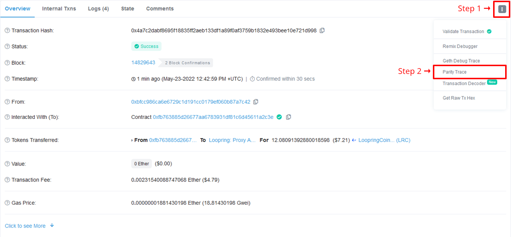
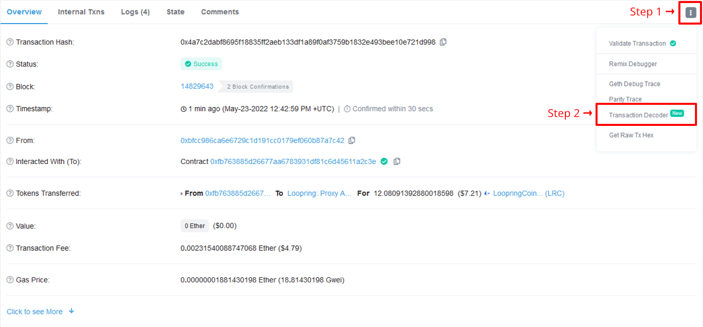
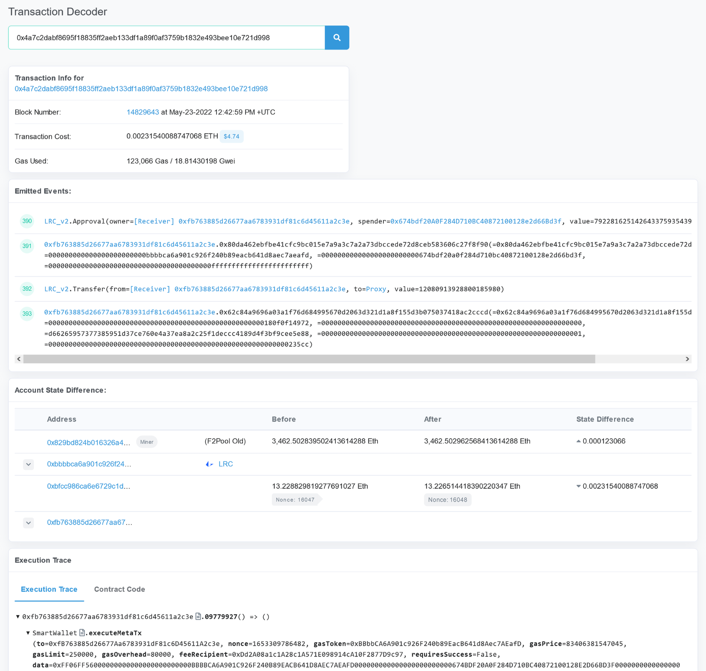
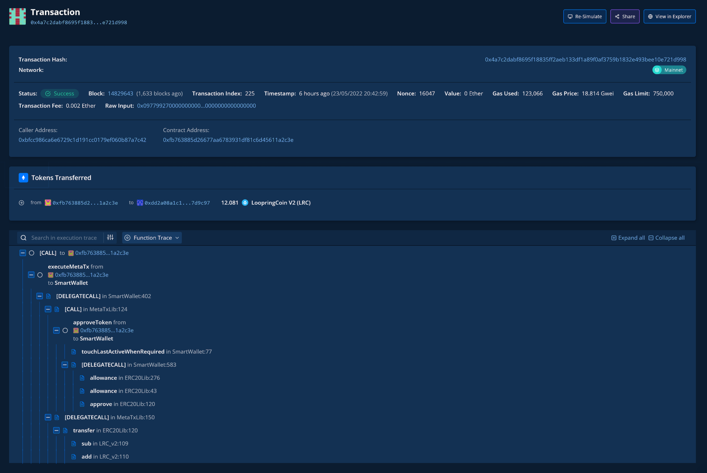

本文章將展示如何使用知名開發框架 Hardhat 的附加元件「hardhat-tracer」，令開發者能視覺化地了解特定 transaction 運作過程，加速開發流程與降低除錯難度。

<!--truncate-->

開發大型智能合約（smart contract）專案的過程中，一定少不了與其他合約互動的過程，例如：DEX 聚合器（aggregator）的開發團隊，就必須熟悉如何與各大 DEX contract 直接互動。因此，取得一款好用的工具能快速、簡要、視覺化地呈現出執行一條 transaction 過程中，發生的所有 message call、event log 就顯得格外重要。本文將介紹幾款工具，分別可解析歷史 transaction 及主網分叉 transaction；隨著目前 smart contract 專案日益複雜，開發者對這方面的需求蓬勃發展，因此新套件推陳出新，亦歡迎熱心的讀者前往 LunDAO [Issues](https://github.com/lun-dao/LunDAO/issues) 或 [Discussions](https://github.com/lun-dao/LunDAO/discussions) 頁面與我們分享。


安裝環境與注意事項
---

本文**不會**提供 Hardhat 的安裝指引或基礎教學，相關內容敬請參考 LunDAO 其他文章。

以下列出筆者實際測試能夠運行本文步驟的軟體條件，實際情況必不限於此配置敬請讀者參酌考量。

- Software
  - Windows
    - OS：Windows 10 Pro 21H1 (w/o WSL)
    - nodejs v16.14.2 和 yarn 1.22.18
  - Linux
    - OS：Ubuntu 20.04.4 LTS (GNU/Linux 5.4.0-1053-raspi aarch64)
    - nodejs v16.14.2 和 yarn 1.22.18

由於本文後續會涉及主網分叉（mainnet forking）的內容，因此強烈推薦讀者應具備此部分的操作經驗，LunDAO 亦已有此部分一系列教學文章，歡迎多加閱讀並與我們討論。


使用圖形化介面工具
---
假設我們對於這筆 transaction [^1]相當有興趣，那麼筆者分享以下四種不同的方法可解析此交易的執行細節。

> 0x4a7c2dabf8695f18835ff2aeb133df1a89f0af3759b1832e493bee10e721d998


### Etherscan Parity Trace



如上圖所示，點擊「Parity Trace」選項之後，將開啟如同下圖的另一個分頁。


此方法呈現的效果較不視覺化，然而應為目前最通用的分析方式；不只 Etherscan 有支援 Parity VM tracer，其它較不熱門的 block explorer 網站應能找到類似功能。


### Etherscan Transaction Decoder



如上圖所示，點擊「Transaction Decoder」選項之後，將開啟如同下圖的另一個分頁。



可以看到 Etherscan 已經幫我們分門別類地將執行 transaction 的過程會發出的 event log、message call 等重要事件，以條列表格的方式呈現出來。


### EthTx.info

此服務以一個使用 Python 撰寫的[開源軟體](https://github.com/ethtx/ethtx)所建立，並由 [Token Flow](https://tokenflow.live/) 這間公司所維護，在筆者撰文當下為免費型式公開讓所有開發者自由使用。

1. 前往 https://ethtx.info/
2. 選擇正確的網路（此例為 ETH mainnet），並輸入對應的 transaction hash
3. 按下「Decode now」按鈕，並靜候數分鐘（可能因網站壅塞度而有不同）


### Tenderly

前往 [Tenderly](https://dashboard.tenderly.co/explorer) 官網，在搜尋框當中輸入 transaction hash 並按下送出查詢，即可獲得如下圖所示的網頁。



由於 Tenderly 提供不只分析特定 transaction 細節的功能，還有許多其它實用的工具（例如：simulator、local transaction analysis）；若讀者有興趣的話，較建議註冊一個免費帳號，以啟用更多功能。

[^1]: 筆者隨機挑選的 transaction，並沒有任何其它特殊用意


使用 hardhat-tracer 套件
---
以下開始介紹如何使用 hardhat-tracer 套件解析特定 transaction 的執行內容。由於 hardhat-tracer 會需要向 Ethereum node 發送 `debug_traceTransaction`、`eth_getStorageAt`、`eth_getCode` 等 JSON-RPC method 撈取歷史資料，因此務必確認節點處於歸檔節點（archive node）模式。您可以選擇自行架設[^2] archive node，或使用節點供應商提供的服務；在筆者撰文的當下，Alchemy 仍有提供免費 Ethereum mainnet archive node，因此筆者選擇使用此服務。

假設我們想知道這個 transaction [^1] 的詳細運作過程
> 0xca722f52d743bfecb555993d64439aa6e6653914ad87073fb27bfbe42f67d62c

關於 `hardhat.config.js` 的內容，以下為與此套件有關的部分，其他細節請參考別篇說明文件

```Javascript
module.exports = {
    networks: {
        mainnet: {
          url: process.env.AlchemyURL,
        },
        hardhat: {
            forking: {
                url: process.env.AlchemyURL,
            }
        },
    },
};
```

1. 在資料夾底下安裝 hardhat-tracer 套件（假設該資料夾已安裝完成 Hardhat）

```Shell
$ yarn add hardhat-tracer
```

2. 執行以下指令（注意要指定 `--network` 參數[^3]讓 Hardhat 能連結到正確的網路）

```Shell
$ yarn hardhat --network "hardhat" trace --hash "0xca722f52d743bfecb555993d64439aa6e6653914ad87073fb27bfbe42f67d62c"
```

3. 等候數分鐘之後，就可以看到 terminal 顯示以下資訊

```Shell
$ yarn hardhat --network "hardhat" trace --hash "0xca722f52d743bfecb555993d64439aa6e6653914ad87073fb27bfbe42f67d62c"
yarn run v1.22.18

Seems that it is taking time to fetch the state involved.
Please note that this process may take several minutes.
A lot of eth_getStorageAt requests are currently being made to the rpc.

CALL UnknownContractAndFunction(to=0x3b7157e5e732863170597790b4c005436572570f, input=0xf6326fb3, ret=0x)
   EVENT <UnknownContract 0x3b7157E5E732863170597790b4c005436572570F>.UnknownEvent(0x000000000000000000000000000000000000000000000000008e1bc9bf040000, [0x8752a472e571a816aea92eec8dae9baf628e840f4929fbcc2d155e6233ff68a7, 0x000000000000000000000000e760f546a925a4cfdcc62a674d14cc42a676c06f, 0x000000000000000000000000c02aaa39b223fe8d0a0e5c4f27ead9083c756cc2])
   CALL UnknownContractAndFunction(to=0xc02aaa39b223fe8d0a0e5c4f27ead9083c756cc2, input=0xd0e30db0, ret=0x)
      EVENT <UnknownContract 0xC02aaA39b223FE8D0A0e5C4F27eAD9083C756Cc2>.UnknownEvent(0x000000000000000000000000000000000000000000000000008e1bc9bf040000, [0xe1fffcc4923d04b559f4d29a8bfc6cda04eb5b0d3c460751c2402c5c5cc9109c, 0x0000000000000000000000003b7157e5e732863170597790b4c005436572570f])
```

4. 以上解析結果為 hardhat-tracer 預設解析模式，僅顯示 event log 和 function call；若您想要一併了解 state variables 的讀寫情況（`SLOAD`、`SSTORE`），那麼可以多加上 `--fulltrace` 參數

```Shell
$ yarn hardhat --network "hardhat" trace --fulltrace --hash "0xca722f52d743bfecb555993d64439aa6e6653914ad87073fb27bfbe42f67d62c"
yarn run v1.22.18

Seems that it is taking time to fetch the state involved.
Please note that this process may take several minutes.
A lot of eth_getStorageAt requests are currently being made to the rpc.

CALL UnknownContractAndFunction(to=0x3b7157e5e732863170597790b4c005436572570f, input=0xf6326fb3, ret=0x)
   SLOAD 0x0000000000000000000000000000000000000000000000000000000000000001 => (0x0000000000000000000000000000000000000000000000000000000000000001)
   SSTORE 0x0000000000000000000000000000000000000000000000000000000000000001 <= (0x0000000000000000000000000000000000000000000000000000000000000002)
   SLOAD 0x0000000000000000000000000000000000000000000000000000000000000005 => (0x0000000000000000000000000000000000000000000000000000000062196d80)
   SLOAD 0x0000000000000000000000000000000000000000000000000000000000000006 => (0x00000000000000000000000000000000000000000000000000000000621d6200)
   SLOAD 0x5cc08dfcef394bb3e1501dd9c602b313a910bc96e6e3b9f14c10c5608560cb26 => (0x0000000000000000000000005f4ec3df9cbd43714fe2740f5e3616155c5b8419)
   SLOAD 0xe49870035e3714aceb7aadebead18a1e5a95f2d32ab68a7ffb99d8329af3a56d => (0x0000000000000000000000000000000000000000000000000000000000000000)
   SLOAD 0xe49870035e3714aceb7aadebead18a1e5a95f2d32ab68a7ffb99d8329af3a56d => (0x0000000000000000000000000000000000000000000000000000000000000000)
   SSTORE 0xe49870035e3714aceb7aadebead18a1e5a95f2d32ab68a7ffb99d8329af3a56d <= (0x000000000000000000000000c02aaa39b223fe8d0a0e5c4f27ead9083c756cc2)
   SLOAD 0xe49870035e3714aceb7aadebead18a1e5a95f2d32ab68a7ffb99d8329af3a56e => (0x0000000000000000000000000000000000000000000000000000000000000000)
   SSTORE 0xe49870035e3714aceb7aadebead18a1e5a95f2d32ab68a7ffb99d8329af3a56e <= (0x000000000000000000000000000000000000000000000000008e1bc9bf040000)
   SLOAD 0x5cc08dfcef394bb3e1501dd9c602b313a910bc96e6e3b9f14c10c5608560cb27 => (0x00000000000000000000000000000000000000000000025e69bc17dc01d0d07f)
   SSTORE 0x5cc08dfcef394bb3e1501dd9c602b313a910bc96e6e3b9f14c10c5608560cb27 <= (0x00000000000000000000000000000000000000000000025e6a4a33a5c0d4d07f)
   EVENT <UnknownContract 0x3b7157E5E732863170597790b4c005436572570F>.UnknownEvent(0x000000000000000000000000000000000000000000000000008e1bc9bf040000, [0x8752a472e571a816aea92eec8dae9baf628e840f4929fbcc2d155e6233ff68a7, 0x000000000000000000000000e760f546a925a4cfdcc62a674d14cc42a676c06f, 0x000000000000000000000000c02aaa39b223fe8d0a0e5c4f27ead9083c756cc2])
   CALL UnknownContractAndFunction(to=0xc02aaa39b223fe8d0a0e5c4f27ead9083c756cc2, input=0xd0e30db0, ret=0x)
      SLOAD 0x42dd4d28989ab1eee96fb196b01de4c17c0f145bc71364b95645949f1f133408 => (0x00000000000000000000000000000000000000000000025e69bc17dc01d0d07f)
      SSTORE 0x42dd4d28989ab1eee96fb196b01de4c17c0f145bc71364b95645949f1f133408 <= (0x00000000000000000000000000000000000000000000025e6a4a33a5c0d4d07f)
      EVENT <UnknownContract 0xC02aaA39b223FE8D0A0e5C4F27eAD9083C756Cc2>.UnknownEvent(0x000000000000000000000000000000000000000000000000008e1bc9bf040000, [0xe1fffcc4923d04b559f4d29a8bfc6cda04eb5b0d3c460751c2402c5c5cc9109c, 0x0000000000000000000000003b7157e5e732863170597790b4c005436572570f])
   SSTORE 0x0000000000000000000000000000000000000000000000000000000000000001 <= (0x0000000000000000000000000000000000000000000000000000000000000001)
```

到這邊為止，我們已經成功使用 hardhat-tracer 套件來解析 transaction 了。然而，以上資訊相比 GUI 來說仍不夠最佳可讀性，尤其合約地址、event 名稱等都以原始型態呈現，造成版面相當冗長且混亂。

所幸 hardhat-tracer 套件提供 address name tag 功能，讓我們可以自定義什麼地址要以什麼名稱標籤來顯示。另外，hardhat-tracer 也支援匯入已知合約的程式碼或 `interface`，讓解析結果可以自動帶入該合約來顯示。

根據上述結果，我們可以發現到執行這個 transaction 的過程會與兩個合約互動 — `0x3b7157E5E732863170597790b4c005436572570F` 和 `0xC02aaA39b223FE8D0A0e5C4F27eAD9083C756Cc2`，因此我們可以前往 Etherscan 來查詢這兩個合約的 ABI 分別為何？再搭配 [ABI2Solidity](https://bia.is/tools/abi2solidity/) 把 JSON format ABI 轉成 solidity `interface` format。

5. 按照一般使用 Hardhat 的習慣，我們在 `contracts` 子目錄底下創建這份 solidity code [^4]

```solidity
// SPDX-License-Identifier: GPL-3.0
pragma solidity 0.8.7;

// Assume that 0x3b7157E5E732863170597790b4c005436572570F is named as "TokenSale".
interface TokenSale {
  function WETH (  ) external view returns ( address );
  function allocateTokensForSale ( uint256 _amount ) external;
  function availableTokens (  ) external view returns ( uint256 );
  function deposit ( address _token, uint256 _amount ) external;
  function depositETH (  ) external;
  function enableWithdrawals (  ) external;
  function finalizeRaise (  ) external;
  function getSupportedTokens (  ) external view returns ( address[] memory );
  function getTokenOracle ( address _token ) external view returns ( address );
  function getTokenOracles (  ) external view returns ( address[] memory oracles );
  function getUserClaimableTokens ( address _user ) external view returns ( uint256 );
  function owner (  ) external view returns ( address );
  function renounceOwnership (  ) external;
  function saleSchedule (  ) external view returns ( uint256 startTimestamp, uint256 endTimestamp );
  function saleToken (  ) external view returns ( address );
  function setSaleSchedule ( uint256 _start, uint256 _end ) external;
  function totalRaisedUSD (  ) external view returns ( uint256 );
  function transferOwnership ( address newOwner ) external;
  function transferToTreasury (  ) external;
  function treasury (  ) external view returns ( address );
  function userAccounts ( address ) external view returns ( address token, uint256 depositedAmount );
  function withdraw (  ) external;
  function withdrawalsEnabled (  ) external view returns ( bool );
}

//  Assume that 0xC02aaA39b223FE8D0A0e5C4F27eAD9083C756Cc2 is named as "WrappedEther".
interface WrappedEther {
  function name (  ) external view returns ( string memory );
  function approve ( address guy, uint256 wad ) external returns ( bool );
  function totalSupply (  ) external view returns ( uint256 );
  function transferFrom ( address src, address dst, uint256 wad ) external returns ( bool );
  function withdraw ( uint256 wad ) external;
  function decimals (  ) external view returns ( uint8 );
  function balanceOf ( address ) external view returns ( uint256 );
  function symbol (  ) external view returns ( string memory );
  function transfer ( address dst, uint256 wad ) external returns ( bool );
  function deposit (  ) external payable;
  function allowance ( address, address ) external view returns ( uint256 );
}
```

6. 執行 `$ yarn hardhat compile` 編譯所有 solidity codes
7. 進入 `hardhat.config.js` 新增以下設定欄位

```Javascript
module.exports = {
    tracer: {
        nameTags: {
            ["0x3b7157E5E732863170597790b4c005436572570F"]: "TokenSale",
            ["0xC02aaA39b223FE8D0A0e5C4F27eAD9083C756Cc2"]: "WrappedEther",
            ["0xe760f546a925a4cfdcc62a674d14cc42a676c06f"]: "Someone",
        }
    },
};
```

1. 重新執行 hardhat-tracer 指令，我們可以看到解析結果變得可讀性很高

```Shell
$ yarn hardhat --network "hardhat" trace --hash "0xca722f52d743bfecb555993d64439aa6e6653914ad87073fb27bfbe42f67d62c"
yarn run v1.22.18

Seems that it is taking time to fetch the state involved.
Please note that this process may take several minutes.
A lot of eth_getStorageAt requests are currently being made to the rpc.

CALL TokenSale.depositETH{value: 40000000000000000}()
   EVENT TokenSale.Deposited(depositor=[Someone], token=[WrappedEther], amount=40000000000000000)
   CALL WrappedEther.deposit{value: 40000000000000000}()
      EVENT WrappedEther.Deposit(dst=[TokenSale], wad=40000000000000000)
```

[^2]: 需要準備大容量 SSD，其餘硬體條件較無嚴苛限制（樹梅派 4B 即足以運行 Go-Ethereum）

[^3]: 由於 `debug_traceTransaction` 屬於 Alchemy 需付費的 API method，因此若讀者使用 Growth 以上的方案，那麼您可以直接以 `--network "mainnet"` 連結 Alchemy；另一種免費的替代方案則為改用 Hardhat Network 來解析 transaction，只對 Alchemy 發送 `eth_getStorageAt`、`eth_getCode` 等請求，因此筆者在此以 `--network "hardhat"` 參數舉例

[^4]: 如果讀者知道待解析 transaction 的所有互動合約 source code，那麼推薦您直接把那些程式碼加入 `contracts` 子目錄底下做編譯，這樣能讓 hardhat-tracer 顯示結果擁有最高的可讀性；若無法取得所有 source code，則只使用合約們 ABI 所轉成的 `interface` 做編譯亦可。


Related resources
---
- Etherscan Transaction Decoder
  - https://etherscan.io/tx-decoder
- Alchemy
  - https://www.alchemy.com/
- Wrapped Ether
  - https://weth.io/index.html
